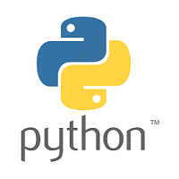
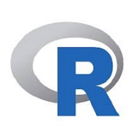
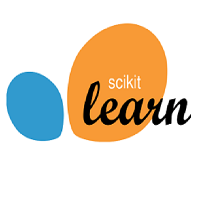
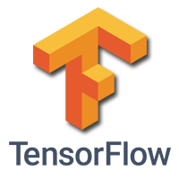

  

I am a final year engineering student specialized in Data Science. I am passionate about new technologies and artificial intelligence and I am always ready to reveal new challenges.

[ LinkedIn](https://www.linkedin.com/)

## Technologies

<table>
  <tr>
    <td> </td>
    <td> </td>
    <td> </td>
    <td> </td>
    <td> </td>
    <td> </td>
  </tr>
</table>

<!--
**Manel-Fares/Manel-Fares** is a ✨ _special_ ✨ repository because its `README.md` (this file) appears on your GitHub profile.

Here are some ideas to get you started:

- 🔭 I’m currently working on decision support system based on ontology learning
- 🌱 I’m currently learning Data Science : NLP, Deep Learning, recommendation systems
- 👯 I’m looking to collaborate on ...
- 🤔 I’m looking for help with ...
- 💬 Ask me about ...
- 📫 How to reach me: ...
- 😄 Pronouns: ...
- ⚡ Fun fact: ...
-->
